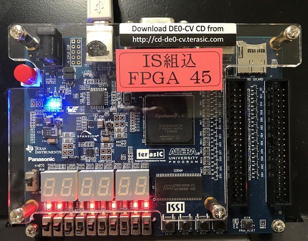

IS3 マイクロコンピュータ基礎 HDL実習

# 1章 実習ボード、開発ツールの使い方

---

## 実習ボードについて

本実習では Intel社(ALTERA社)のFPGAチップCyclone Vが搭載された
DE0-CV開発ボードを使います。
このボードは、スライドスイッチ(SW9-0)、プッシュスイッチ(KEY0-4)、
LED(LEDR9-0)、7セグメントLED(HEX5-0)、GPIOなど多くのI/Oを
備えています。

[http://cd-de0-cv.terasic.com](http://cd-de0-cv.terasic.com)
より、ユーザーマニュアルをダウンロードしておいてください。

---

## 開発ツールについて

本実習では回路設計を行うための EDA(electronic design automation) ツールとして Quartus Prime Lite Edition を利用します。

[インテル Quartus Prime](https://www.altera.co.jp/products/design-software/fpga-design/quartus-prime/download.html)

---

# 実習ボード・開発ツールの使い方

実習ボードのスライドスイッチSW7-0に入力された0/1のビットパターンを
そのままLEDのLEDR7-0に表示する回路の設計実装を行う実習を通して、
実習ボードと開発ツールの使い方を学んでいきましょう。



---
## Directory, Name, Top-Level Entityの設定

Quartus Prime Lite Editionを起動します。

起動したら、[File]>[New Project Wizard]
よりプロジェクト作成のためのウィザードを起動し、下記を設定します。
- working directory (プロジェクトフォルダが置かれる作業フォルダ)
- project (プロジェクト名)
- top-level entity (PIN接続される一番外側の回路モジュール名)

設定例:
- working directory: Z:/digital/working_directory
- project: simple_io
- top-level entity: simple_io

---

## Project Typeの設定

今回はEmpty projectを選択してください。

---
## Add Filesの設定

既に作成したデザインファイルやライブラリを
プロジェクトに取り込みたい場合に設定します。

今回は何も追加せずに次に進んでください。

---
## Family, Device & Board Settings

開発対象のデバイス(FPGAチップ)を選択します。

今回は Cyclone V 5CEBA4F23C7 を選択します。

---
## EDA Tool Settings

シミュレータなど他のEDAツールを使う場合の設定です。

今回はそのままで次に進んでください。

---
## Summary

これまでの設定をここで確認します。
問題なければ[Finish]を押してください。
プロジェクトのひな型が作成されます。

---
## デザインファイルの作成
[File]>[New]>[Design Files/SystemVerilog HDL File]を選択します。

エディタが立ち上がりますので、リスト1.1のデザインファイルを作成し、
適切なファイル名を付けて保存します。
ファイル名は simple_io.sv の様に拡張子を .sv としてください。

なお、モジュール名(module の後についている名前)は
top-level entityと同じにする必要があります。

<リスト1.1 siple_io.sv>

````systemverilog
module simple_io(
  input   logic [7:0] sw,
  output  logic [7:0] led
);

  assign led = sw;

endmodule
````

---
## デザインファイルの解析

[Processing]>[Start]>[Start Analysis & Elaboration]
を選択し、デザインファイルの解析を行います。

下記の様に表示されれば大丈夫です。

```
Info: Quartus Prime Analysis & Elaboration was successful.
```

デザインファイルに誤りがあると下記の様なエラー表示がでます。
修正を行ったうえで再度[Start Analysis & Elaboration]を行ってください。

```
Error (10161): Verilog HDL error at simple_io.sv(8): ...
```

---
## Pin plannerによるピンの設定

[Assignments]>[Pin Planner]を選択してPin Plannerを起動します。

作成した simple_io モジュールの入出力ポートが適切なI/Oデバイスに
接続されるよう、ピンの割り当てを行います。

今回はled[7]-led[0]がボードのLEDR9-0、sw[7]-[0]がSW9-0に接続されるように表1.1のとおりピンの設定を行います。

<表1.1 simple_ioモジュールのピン割り当て>

|Node Name|Location|
|:---|:---|
|led[0]|PIN_AA2|
|led[1]|PIN_AA1|
|led[2]|PIN_W2|
|led[3]|PIN_Y3|
|led[4]|PIN_N2|
|led[5]|PIN_N1|
|led[6]|PIN_U2|
|led[7]|PIN_U1|
|sw[0]|PIN_U13|
|sw[1]|PIN_V13|
|sw[2]|PIN_T13|
|sw[3]|PIN_T12|
|sw[4]|PIN_AA15|
|sw[5]|PIN_AB15|
|sw[6]|PIN_AA14|
|sw[7]|PIN_AA13|

実習ボードDE0-CVにおいて、
各ピンがどのI/Oデバイスに接続されているかは
ユーザーマニュアルを確認してください。

---
## プロジェクトのコンパイル

[Processing]>[Start Compilation]を選択して、
プロジェクトのコンパイルを行います。

しばらく時間がかかります。下記の様に表示されるとコンパイル成功です。

```
Info (293000): Quartus Prime Full Compilation was successful.
```

---
## デバイスへの回路情報の書き込み

コンパイルで作成された回路情報を実習ボードに書き込みます。

まず、PCと実習ボードDE0-CVをUSBケーブルで接続し、実習ボードの電源を入れます。
SW10はRUNに設定しておいてください。

Quartus Primeの方で、[Tools]>[Programmer]を選択しProgrammerを起動します。

- [Hardware Setup]でUSB-Blaster[USB-0]を選択
- ModeはJTAGを選択

Fileが空欄の場合は[Add File]より output_files/ 下にあるsofファイルを選び追加してください。

sofファイルのProgram/Configureにチェックを入れてください。

この状態で[Start]をクリックすると、書き込みが開始されます。
Progressが100%になると書き込み完了です。

---

## 動作確認

実習ボードDE0-CVのスライドスイッチSW7-0をいろいろと切り替えて、
LEDR7-0がどの様に点灯するかを確認しましょう。

## プロジェクトの保存

[File]>[Save Project]より、プロジェクトの保存ができます。

次回以降、保存したプロジェクトを利用したいときは
[File]>[Open Project]からプロジェクト名の付いたqpfファイルを選択します

---

## 演習課題

新たなプロジェクトを作成し、リスト1.2に示すデザインファイルで設計される回路を実装しましょう。
ただし、プロジェクトのtop-level entity は bitwise_and とします。
また、ピンの割り当ては表1.2の通りとします。

この回路がどのような動作をするか、スライドスイッチsw7-0をいろいろと切り替え観察しましょう。

<リスト1.2 bitwise_and.sv>

````systemverilog
module bitwise_and(
  input   logic [3:0] sw_high,
  input   logic [3:0] sw_low,
  output  logic [3:0] led
);

  assign led = sw_high & sw_low;

endmodule
````

<表1.2 bitwise_and のピンの割り当て>

|Node Name|Location|
|:---|:---|
|led[0]|PIN_AA2|
|led[1]|PIN_AA1|
|led[2]|PIN_W2|
|led[3]|PIN_Y3|
|sw_low[0]|PIN_U13|
|sw_low[1]|PIN_V13|
|sw_low[2]|PIN_T13|
|sw_low[3]|PIN_T12|
|sw_high[0]|PIN_AA15|
|sw_high[1]|PIN_AB15|
|sw_high[2]|PIN_AA14|
|sw_high[3]|PIN_AA13|
