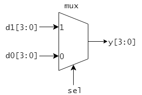

IS3 マイクロコンピュータ基礎 HDL実習

# 2章 SystemVerilog 101

本章では、SystemVerilogの文法のうち、必要最低限の基本部分を説明します。

---

## module および assign文

SystemVerilogではモジュールを一つの単位として回路を記述していきます。
モジュールについての記述は、予約語の module と endmodule に囲まれます。

 <リスト2.1 simple_ioモジュール>

```SystemVerilog
module simple_io(         // (1) モジュール名: simple_io
  // ポートリスト
  input   logic [7:0] a,  // (2) 8-bit logic 型の入力信号
  output  logic [7:0] y   // (3) 8-bit logic 型の出力信号
);

  // 回路記述
  assign y = a;           // (4)

endmodule
```

リスト2.1に簡単な回路モジュールを示しました。

まず、モジュール名とポートリストを記述します。
予約語 module の後にモジュール名を指定し(リスト中(1))、続いて回路モジュールの入出力信号を宣言するポートリストを示します。
リスト2.1のポートリストでは 8-bit logic 型の入力 a と、8-bit logic 型の出力 b があることが示されています(リスト中(1)(2))。
なお、logic型の信号は論理 0, 1と、ハイインピーダンス状態 z および不定値 x の4値を取りえます。

8-bitの信号 a の各ビットは a[7], a[6], ..., a[0] のように記述できます。y についても同様です。
また、例えばa[7], a[6], a[5], a[4] をまとめて、a[7:4] のように記述することもできます。

リスト2.1の(4)の部分では回路の内部の構造を記述しています。
ここでは、 assign 文によって、左辺の(出力)信号 y に右辺の(入力)信号 a を割り当てています。
ここでは8-bitの信号 y と a を使って8ビット分の信号の割り当てをまとめて行っていますが、以下のように各ビットごとに割り当てを記述することもできます。

<リスト2.2 各ビットごとの割り当て>

```SystemVerilog
  // リスト2.1 (4)は下記のように書いてもよい
  assign y[7] = a[7];
  assign y[6] = a[6];
  assign y[5] = a[5];
  assign y[4] = a[4];
  assign y[3] = a[3];
  assign y[2] = a[2];
  assign y[1] = a[1];
  assign y[0] = a[0];
```

---

## ビット論理演算

<リスト2.3 logic_gates モジュール>

```SystemVerilog
module logic_gates(
  input  logic [1:0] a,
  input  logic [1:0] b,
  output logic [1:0] y1,
  output logic [1:0] y2,
  output logic [1:0] y3,
  output logic [1:0] y4,
  output logic [1:0] y5
);

  assign y1 = a & b;      // (1) bitwise AND
  assign y2 = a | b;      // bitwise OR
  assign y3 = a ^ b;      // bitwise XOR
  assign y4 = ~a;         // bitwise NOT
  assign y5 = ~(a & b);   // bitwise NAND

endmodule
```

リスト2.3に様々なビット論理演算を用いて構成した回路モジュール logic_gate を示しました。
このモジュールは 2 つの 2-bit 信号 a, b を入力信号とし、5つの 2-bit 信号 y1, y2, y3, y4, y5 を出力信号とします。
y1, y2, y3 にはそれぞれ a と b のビットごとのAND, OR, XOR をとったものが出力されます。
y4 には a のビットごとのNOT、y5 には a と b のビットごとのNANDが出力されます。

リスト2.3中の(1)の部分は下記のようにビットごとに割り当てを行っても同じです。

<リスト2.4 ビットごとの割り当て>

```SystemVerilog
  // リスト2.3の(1)は下記のように書いてもよい
  assign y1[1] = a[1] & b[1];
  assign y1[0] = a[0] & b[0];
```

### 演習

リスト2.3の logic_gates モジュールを実習ボード DE0-CV に実装してその動作を確認しましょう。(Top-Level Entity を logic_gatesとします)

logic_gates モジュールの入出力信号は表2.1のように DE0-CV の入出力デバイスに割り当てましょう。

<表2.1 logic_gates モジュールの入出力のデバイスへの割り当て>

|信号名|割り当てデバイス|入出力|
|------|----------------|------|
|a[1:0]| SW3-SW2          | input |
|b[1:0]| SW1-SW0          | input |
|y1[1:0]| LEDR9-LEDR8       | output |
|y2[1:0]| LEDR7-LEDR6        | output |
|y3[1:0]| LEDR5-LEDR4        | output |
|y4[1:0]| LEDR3-LEDR2        | output |
|y5[1:0]| LEDR1-LEDR0        | output |

---

## 定数リテラル

定数リテラルはリスト2.5のようにビット幅と基数(2進、8進、10進、16進)を指定して記述します。
定数を用いるときは、原則ビット幅を指定するようにしましょう。
アンダースコア(\_)は無視されますので、長い数を見やすいように適宜挿入するとよいです。

<リスト2.5 定数リテラル>

````SystemVerilog
  // 3-bit 幅の定数 5(10進) の表示方法
  3'b101        // 3-bit 2進数表示
  3'o5          // 3-bit 8進数表示
  3'd5          // 3-bit 10進数表示
  3'h5          // 3-bit 16進数表示

  // 8-bit 幅の定数 172(10進) の表示方法
  8'b1010_1100; // 2進数表示
  8'o254        // 8進数表示
  8'd172        // 10進数表示
  8'hAC         // 16進数表示
````

リスト2.6に定数を利用した回路モジュールを示します。

<リスト2.6 mask_C3 モジュール>

```SystemVerilog
module mask_C3 (
  input  logic [7:0] a,
  output logic [7:0] y
);
  assign y = a & 8'b1100_0011;
  // assign y = a & 8'hC3 と書いても同じ
endmodule
```

### 演習

リスト2.6の mask_C3 モジュールを実習ボード DE0-CV に実装してその動作を確認しましょう。

mask_C3 モジュールの入出力信号は表2.2のように DE0-CV の入出力デバイスに割り当てましょう。

<表2.2 mask_C3 モジュールの入出力のデバイスへの割り当て>

|信号名|割り当てデバイス|入出力|
|------|----------------|------|
|a[7:0]| SW7-SW0          | input |
|y[7:0]| LEDR7-LEDR0        | output |

---

## 3項演算( ? : )

リスト2.7の mux モジュールは図2.1のようなマルチプレクサを与えます。

<リスト2.7 mux モジュール>

```systemverilog
module mux(
  input   logic       sel,
  input   logic [3:0] d0,
  input   logic [3:0] d1,
  output  logic [3:0] y;
);

  assign y = (sel == 1'd1) ? d1 : d0; // (1)
endmodule
```



<図2.1 mux で与えられるマルチプレクサ>

mux4 モジュールは1-bitの信号 sel が 1 の時は y に d1 を出力し、そうでない場合は y に d0 を出力します。
リスト中(1)では3項演算を利用しています。? の左側には条件を記述します。
条件部分には相等比較(==, !=)や大小比較(<, <=, >, >=)を使うことができます。
条件が成り立つときに返す値を : の左側(? と : に挟まれた部分)、条件が成り立たないとき位返す値を : の右側に書きます。

### 演習

リスト2.7の mux モジュールを実習ボード DE0-CV に実装してその動作を確認しましょう。

mux モジュールの入出力信号は表2.3のように DE0-CV の入出力デバイスに割り当てましょう。

<表2.3 mux モジュールの入出力のデバイスへの割り当て>

|信号名|割り当てデバイス|入出力|
|------|----------------|------|
|sel   | SW9          | input |
|d1[3:0]| SW7-SW4          | input |
|d0[3:0]| SW3-SW0       | input |
|y[3:0] | LEDR3-LEDR0        | output |

---

## ビット連接

リスト2.8にビット連接を使った回路モジュールを示します。

<リスト2.8 bitmix モジュール>

```systemverilog
module bitmix(
  input   logic [3:0] a,
  input   logic [3:0] b,
  output  logic [7:0] y
);

  assign y = {a[1:0], b, a[3:2]}; // (1)

endmodule
```

リスト中(1)の右辺にあるように、信号を{}でくくることで複数の信号のビット連接を行うことができます。
下記リスト2.9のように書いたものと同じ働きとなります。

<リスト2.9 ビットごとの割り当て>

```systemverilog
  // リスト2.8 (1)は下記のように書いてもよい
  assign y[7] = a[1];
  assign y[6] = a[0];
  assign y[5] = b[3];
  assign y[4] = b[2];
  assign y[3] = b[1];
  assign y[2] = b[0];
  assign y[1] = a[3];
  assign y[0] = a[2];
```

### 演習

リスト2.8の bitmix モジュールを実習ボード DE0-CV に実装してその動作を確認しましょう。

bitmix モジュールの入出力信号は表2.3のように DE0-CV の入出力デバイスに割り当てましょう。

<表2.3 bitmix モジュールの入出力のデバイスへの割り当て>

|信号名|割り当てデバイス|入出力|
|------|----------------|------|
|a[3:0]| SW7-SW4          | input |
|b[3:0]| SW3-SW0       | input |
|y[7:0] | LEDR7-LEDR0        | output |

---

## 算術演算(加減算)

<リスト2.10 adder モジュール(4ビット加算器)>

```systemverilog
module adder(
  input   logic [3:0] a,
  input   logic [3:0] b,
  output  logic [3:0] sum,
  output  logic       carry
);

  assign {carry, sum} = a + b; // (1)

endmodule
```

リスト2.10のadderモジュールは 4-bit の信号 a と b を加算し、その加算結果を 4-bit のsum に出力し、繰り上がりを 1-bit の carry に出力します。

リスト中(1)のように、加算は + 演算子を用いて書くことができます。同様に減算は - 演算子を使って記述できます。

### 演習

リスト2.10の adder モジュールを実習ボード DE0-CV に実装してその動作を確認しましょう。

adder モジュールの入出力信号は表2.4のように DE0-CV の入出力デバイスに割り当てましょう。

<表2.4 adder モジュールの入出力のデバイスへの割り当て>

|信号名|割り当てデバイス|入出力|
|------|----------------|------|
|a[3:0]| SW7-SW4          | input |
|b[3:0]| SW3-SW0          | input |
|carry | LEDR9          | output |
|y[3:0]| LEDR3-LEDR0        | output |


---
## always文

レジスタなどの順序回路や、エンコーダ・デコーダなどの複雑な組み合わせ回路は always 文(always_ff 文、always_comb 文など)を使って設計できます。
always 文を使った回路設計については、3章と4章において説明します。
