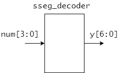
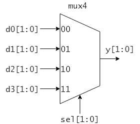

IS3 マイクロコンピュータ基礎 HDL実習

# 4章 組み合わせ論理回路の設計

本章では、always_comb 文を用いて加算器やエンコーダ、マルチプレクサなどの組み合わせ論理回路を設計する方法を学びます。

---
## 4ビット加算器

2章のリスト2.10で示した4ビット加算器 adder モジュールは、リスト4.1のように always_comb 文を用いて記述することもできます。

<リスト4.1 adder モジュール(4ビット加算器)>

````SystemVerilog
module adder(
  input   logic [3:0] a,
  input   logic [3:0] b,
  output  logic [3:0] sum,
  output  logic       carry
);

  always_comb begin
    {carry, sum} = a + b;
  end

endmodule
````

always_comb 文はいずれかの信号に変化があったときに起動し、begin ~ endで囲まれた部分を実行するような回路を構築します。

always_comb 文中での代入には、レジスタの設計時に用いたノンブロッキング代入 `<=` ではなく `=` が使われています。
この `=` による代入はブロッキング代入と呼ばれます。
組み合わせ回路を always_comb 文を用いて設計する場合には、原則としてブロッキング代入 `=` を用いるのが良い習慣です。
フリップフロップを使った回路の設計には、ノンブロッキング代入 `<=` を使い、組み合わせ論理回路の設計には、ブロッキング代入 `=` を使うようにしておくことで、どちらの回路を記述しているのかを分かりやすく表明することができます。

### 演習

リスト4.1の adder モジュールを実習ボード DE0-CV に実装してその動作を確認しましょう。

adder モジュールの入出力信号は表4.1のように DE0-CV の入出力デバイスに割り当てましょう。

<表4.1 adder モジュールの入出力のデバイスへの割り当て>

|信号名|割り当てデバイス|入出力|
|------|----------------|------|
|a[3:0]| SW7-SW4          | input |
|b[3:0]| SW3-SW0          | input |
|carry | LEDR9          | output |
|sum[3:0]| LEDR3-LEDR0        | output |


---
## 7セグメントデコーダ

4-bit の入力信号 num[3:0] と 7-bit の出力信号 y[6:0] の関係が、表4.2の真理値表で与えられる組み合わせ論理回路 sseg_decoder (図4.1)を設計することを考えます。



<図4.1 7セグメントデコーダ sseg_decoder>

<表4.2 sseg_decoderモジュールの真理値表>

|入力 num[3:0]| 出力 y[6:0]|
|--------|------|
|0000|1000000|
|0001|1111001|
|0010|0100100|
|0011|0110000|
|0100|0011001|
|0101|0010010|
|0110|0000010|
|0111|1011000|
|1000|0000000|
|1001|0010000|
|1010|0001000|
|1011|0000011|
|1100|0100111|
|1101|0100001|
|1110|0000110|
|1111|0001110|

このように、真理値表が与えられている組み合わせ回路は case 文を用いて設計することができます。
リスト4.2に sseg_decoder モジュールの記述例を示します。

<リスト4.2 sseg_decoder モジュール(7セグメントデコーダ)>

```SystemVerilog
module sseg_decoder(
  input   logic [3:0]   num,
  output  logic [6:0]   y
);

  always_comb begin
    case (num)
      4'h0  : y = 7'b100_0000;
      4'h1  : y = 7'b111_1001;
      4'h2  : y = 7'b010_0100;
      4'h3  : y = 7'b011_0000;
      4'h4  : y = 7'b001_1001;
      4'h5  : y = 7'b001_0010;
      4'h6  : y = 7'b000_0010;
      4'h7  : y = 7'b101_1000;
      4'h8  : y = 7'b000_0000;
      4'h9  : y = 7'b001_0000;
      4'ha  : y = 7'b000_1000;
      4'hb  : y = 7'b000_0011;
      4'hc  : y = 7'b100_0110;
      4'hd  : y = 7'b010_0001;
      4'he  : y = 7'b000_0110;
      4'hf  : y = 7'b000_1110;
      default  : y = 7'b111_1111; // 上記で全パターン尽くされているのでこのdefaultは実際は不要
    endcase
  end

endmodule
```

真理値表がほぼそのままcase 文の中に示されていますので、
case 文の働きはおおよそ見てわかるかと思います。
例えば、num = 4'b1010 (= 4'hA)の時は、y に 7'b0001000を出力します。

case 文を用いて組み合わせ論理回路を設計する場合は、すべての入力パターンを尽くすように記述しなければいけません。
必要に応じて default 文などを用い、すべての入力パターンが尽くされるようにしましょう。

### 演習

リスト4.3の sseg_decoder モジュールを実習ボード DE0-CV に実装してその動作を確認しましょう。

sseg_decoder モジュールの入出力信号は表4.3のように DE0-CV の入出力デバイスに割り当てましょう。

<表4.3 sseg_decoder モジュールの入出力のデバイスへの割り当て>

|信号名|割り当てデバイス|入出力|
|------|----------------|------|
|num[3:0]| SW3-SW0      | input |
|y[6:0]| HEX06-HEX00    | output |

---

## マルチプレクサ

図4.2に示す4入力マルチプレクサを設計することを考えます。
表4.4にこの4入力マルチプレクサ mux4 の機能表を示します。



<図4.2 4入力マルチプレクサ mux4>

<表4.4 mux4 モジュールの機能表>

|選択信号 sel[1:0]| 出力 y |
|-----------------|------------|
|00| d0 |
|01| d1 |
|10| d2 |
|11| d3 |

mux4 モジュールはリスト4.3のように、 case 文を用いて記述することができます。

<リスト4.3 mux4 モジュール>

```SystemVerilog
module mux4 (
  input   logic [1:0] sel, // 選択信号
  input   logic [1:0] d0,
  input   logic [1:0] d1,
  input   logic [1:0] d2,
  input   logic [1:0] d3,
  output  logic [1:0] y
);

  always_comb begin
    case (sel)
      2'b00   : y = d0;
      2'b01   : y = d1;
      2'b10   : y = d2;
      2'b11   : y = d3;
      default : y = 2'b00; // 上記で全パターン尽くされているのでこのdefaultは実際は不要
    endcase
  end

endmodule // mux4
```


### 演習

リスト4.3の mux4 モジュールを実習ボード DE0-CV に実装してその動作を確認しましょう。

mux4 モジュールの入出力信号は表4.5のように DE0-CV の入出力デバイスに割り当てましょう。

<表4.5 mux4 モジュールの入出力のデバイスへの割り当て>

|信号名|割り当てデバイス|入出力|
|------|----------------|------|
|sel[1:0]| SW9-SW8      | input |
|d0[1:0] | SW7-SW6      | input |
|d1[1:0] | SW5-SW4      | input |
|d2[1:0] | SW3-SW2      | input |
|d3[1:0] | SW1-SW0      | input |
|y[1:0]| LEDR1-LEDR0    | output |

---
