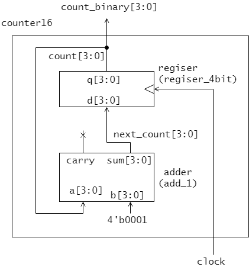

IS3 マイクロコンピュータ基礎 HDL実習

# 5章 モジュールを組み合わせた回路設計

System Verilog ではモジュールを組み合わせ、より大規模な回路モジュールを構築することができます。
本章では、これまでに設計した様々な回路モジュールを組み合わせて新しい回路を設計する方法を学びます。

---
## 7セグメント表示付き加算器

4章のリスト4.1 adder モジュール(4ビット加算器)とリスト4.2 sseg_decoder モジュール(7セグメントデコーダ)を組み合わせ、図5.1のような回路を設計することを考えます。


<図5.1 7セグメント表示機能付き加算器>

図5.1の回路モジュール sseg_adder はその内部で、adder モジュールと sseg_decoder モジュールを利用しています。
adder モジュールの入力 a と b には、sseg_adder の入力 num_a と num_b がそれぞれ接続されています。
同様に、adder モジュールの出力 carry と sseg_decoder モジュールの出力 y は、sseg_adder モジュールの出力 carry と hex_pattern にそれぞれ接続されています。
adder モジュールの出力 sum と sseg_decoder モジュールの入力 num は、sseg_adder の内部信号 sum によって接続されています。
このような、 sseg_adder モジュールはリスト5.1のように記述できます。

<リスト5.1 sseg_adder モジュール(7セグメント表示付き加算器)>

```SystemVerilog
module sseg_adder (
  input   logic [3:0] num_a,
  input   logic [3:0] num_b,
  output  logic [6:0] hex_pattern,
  output  logic       carry
);
  logic [3:0] sum; // (1) sseg_adderモジュールの内部信号

  adder adder_unit ( // (2) adder モジュールの呼び出し(インスタンス化)
    .a      (num_a),
    .b      (num_b),
    .sum    (sum),
    .carry  (carry)
  );

  sseg_decoder decoder_unit ( // (3) sseg_decoderモジュールの呼び出し(インスタンス化)
    .num  (sum),
    .y    (hex_pattern)
  );  

endmodule
```

リスト

## 演習

|信号名|割り当てデバイス|入出力|
|------|----------------|------|
|num_a[3:0]       | SW7-SW4     | input |
|num_b[3:0]       | SW3-SW0     | input |
|hex_pattern[6:0] | HEX06-HEX00 | output |
|carry            | LEDR0       | output |


---
## 16進カウンタ




```SystemVerilog
module counter16 (
  input   logic       clock,
  output  logic [3:0] count_digit  
);
  logic [3:0] count;
  logic [3:0] next_count;

  assign count_digit = count;

  adder add_1 (
    .a      (count),
    .b      (4'b0001),
    .sum    (next_count)
  );

  register register_4bit(
    .clock  (clock),
    .d      (next_count),
    .q      (count)
  );

endmodule
```


|信号名|割り当てデバイス|入出力|
|------|----------------|------|
|clock            | KEY0        | input |
|count_digit[3:0] | LEDR3-LEDR0 | output |

---
## 7セグメント表示付き加算累積器


```SystemVerilog
module add_accumulator (
  input   logic       clock,
  input   logic [3:0] num,  
  output  logic [6:0] hex_pattern
);
  logic [3:0] next_result;
  logic [3:0] result;

  adder adder (
    .a      (result),
    .b      (num),
    .sum    (next_result)
  );

  register register (
    .clock  (clock),
    .d      (next_result),
    .q      (result)
  );

  sseg_decoder decoder (
    .num    (result),
    .y      (hex_pattern)
  );

endmodule
```


|信号名|割り当てデバイス|入出力|
|------|----------------|------|
|clock            | KEY0        | input |
|num[3:0]         | SW3-SW0     | input |
|hex_pattern[6:0] | HEX06-HEX00 | output |
