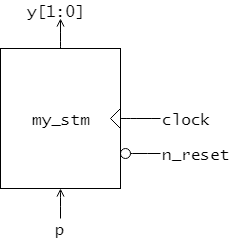
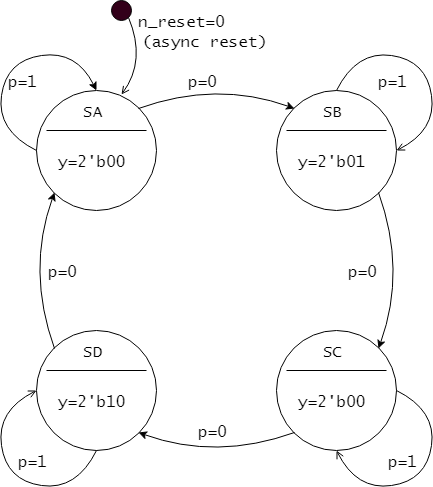
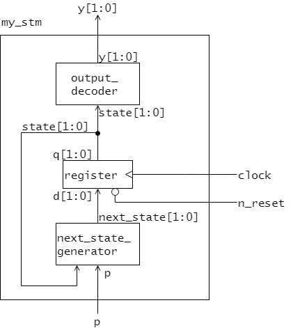

IS3 マイクロコンピュータ基礎 HDL実習

# 6章 状態機械の設計

前章までで、レジスタの設計方法と組み合わせ回路の設計方法、さらにそれらの回路モジュールを組み合わせて新しい回路を設計する方法を学んできました。
レジスタと組み合わせ回路とを組み合わせることで、状態機械を設計することができます。
本章では、状態機械の設計方法を学びます。

---
## 回路仕様





---
## 回路構成




---
## 状態の符号化

```SystemVerilog
module register ( // 非同期リセット付き2ビットレジスタ
  input   logic       clock,
  input   logic       n_reset,
  input   logic [1:0] d,
  output  logic [1:0] q
);

  always @ (posedge clock, negedge n_reset) begin
    if (n_reset == 1'b0) begin
      q <= 2'b00;  // SA にリセット
    end else begin
      q <= d;
    end
  end

endmodule
```

---

## 次状態関数回路

```SystemVerilog
module next_state_generator (
  input   logic [1:0] state,
  input   logic       p,
  output  logic [1:0] next_state
);

  always_comb begin
    case ({p, state})
      3'b0_00:  next_state = 2'b01;
      3'b0_01:  next_state = 2'b10;
      3'b0_10:  next_state = 2'b11;
      3'b0_11:  next_state = 2'b00;
      3'b1_00:  next_state = 2'b00;
      3'b1_01:  next_state = 2'b01;
      3'b1_10:  next_state = 2'b10;
      3'b1_11:  next_state = 2'b11;
      default:  next_state = 2'b00;
    endcase
  end

endmodule //
```

---

## 出力関数

```SystemVerilog
module output_decoder (
  input   logic [1:0] state,
  output  logic [1:0] y
);

  always_comb begin
    case (state)
      2'b00   :  y = 2'b00;
      2'b01   :  y = 2'b10;
      2'b10   :  y = 2'b00;
      2'b11   :  y = 2'b01;
      default :  
    endcase
  end

endmodule //
```

---

## 状態機械の組み上げ

```SystemVerilog
module my_stm (
  input   logic       clock,
  input   logic       n_reset,
  input   logic       p,
  output  logic [1:0] y
);

  logic [1:0] state;      // 今の状態
  logic [1:0] next_state; // 次の状態

  // 状態レジスタ
  register state_register(
    .clock    (clock),
    .n_reset  (n_reset),
    .d        (next_state),
    .q        (state)
  );

  // 次状態関数
  next_state_generator next_state_generator(
    .p          (p),
    .state      (state),
    .next_state (next_state)
  );

  // 出力関数
  output_decoder output_decoder(
    .state      (state),
    .y          (y)
  );

endmodule //
```
