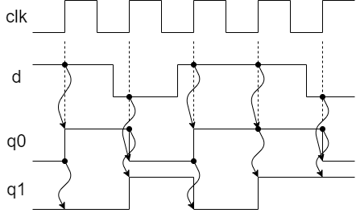

IS3 マイクロコンピュータ基礎 HDL実習

# 7章 その他

---
## 10進カウンタ

````SystemVerilog
module count10 (
  input   logic       clock,
  output  logic [3:0] count
);

  always_ff @ (posedge clock) begin
    if (count >= 4'd9) begin
      count <= 4'd0;
    end else begin
      count <= count + 1'd1;
    end
  end

endmodule
````

---
## parameter

````SystemVerilog
module register #(parameter WIDTH = 8) (
  input                     clock,
  input   logic [WIDTH-1:0] d,
  output  logic [WIDTH-1:0] q
);

  always_ff @ (posedge clock) begin
    q <= d;
  end
endmodule
````

````SystemVerilog
module top (
  input   logic       clock,
  input   logic [1:0] sw_2bit,
  input   logic [7:0] sw_8bit,
  output  logic [1:0] led_2bit,
  output  logic [7:0] led_8bit
);

  // 2-bit レジスタ
  register #(.WIDTH(2)) register_2bit( // registerモジュールのパラメータを上書き(WIDTH = 2)
    .clock  (clock),
    .d      (sw_2bit),
    .q      (led_2bit)
  );

  // 8-bit レジスタ
  register register_8bit (  // パラメータを指定しないとregisterモジュールで指定された値が使われる(WIDTH = 8)
    .clock  (clock),
    .d      (sw_8bit),
    .q      (led_8bit)
  );

endmodule // Top
````

---

## enum

```SystemVerilog
module my_stm (
  input   logic       clock,
  input   logic       n_reset,
  input   logic       p,
  output  logic [1:0] y
);

  // State
  typedef enum logic[1:0] {SA, SB, SC, SD} State;

  State state;

  // next_state_generator + register(with async reset)
  always_ff @ (posedge clock, negedge n_reset) begin
    if (n_reset == 1'b0) begin  // active low async reset
      state <= SA;
    end else begin
      case ({p, state}) //  state transition
        {1'b0, SA}: state <= SB;
        {1'b0, SB}: state <= SC;
        {1'b0, SC}: state <= SD;
        {1'b0, SD}: state <= SA;
        {1'b1, SA}: state <= SA;
        {1'b1, SB}: state <= SB;
        {1'b1, SC}: state <= SC;
        {1'b1, SD}: state <= SD;
        default:    state <= SA;
      endcase
    end
  end

  // output_decoder
  always_comb begin
    case (state)
      SA:       y = 2'b00;
      SB:       y = 2'b01;
      SC:       y = 2'b00;
      SD:       y = 2'b10;
      default:  y = 2'b00;
    endcase
  end

endmodule

```

---

## ノンブロッキング代入とブロッキング代入のちがい

### ノンブロッキング代入

````SystemVerilog
module nonblocking( // shift register
  input   logic clk,
  input   logic d,
  output  logic q0,
  output  logic q1
);

  always_ff @ (posedge clk) begin
    q0 <= d;   // (1)
    q1 <= q0;  // (2)
  end
  
endmodule
````

ノンブロッキング代入を用いた場合、(1)と(2)の代入が並列で実行されます。
したがって、クロック clk の立ち上がりのタイミングで、
q0 には d の値、q1 には直前の q0 の値が代入されます。

 


### ブロッキング代入

````SystemVerilog
module nonblocking( // shift register
  input   logic clk,
  input   logic d,
  output  logic q0,
  output  logic q1
);

  always_ff @ (posedge clk) begin
    q0 = d;   // (1)
    q1 = q0;  // (2)
  end
  
endmodule
````

ブロッキング代入では、上から順に(1)を評価し次に(2)を評価され、その結果、q1 = q0 = d となります。
したがって、クロック clk の立ち上がりのタイミングで、q0, q1 ともに d の値が代入されます。


